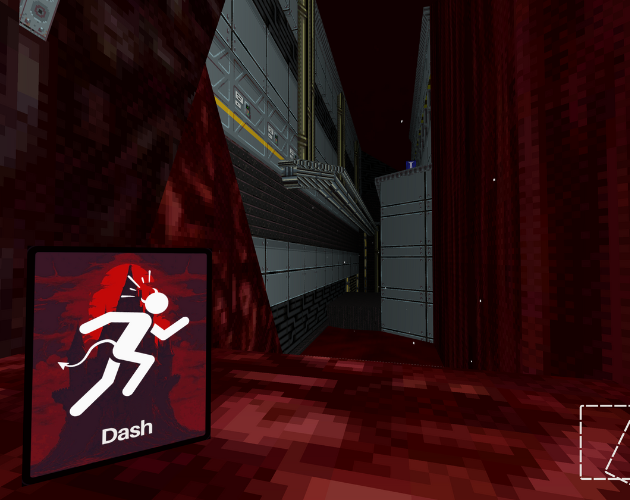

# Sinking
> Godot Game Development Project for Year 13 Digital Technologies at Mount Albert Grammar School
Development ended in October 2024

The game was created as part of my final year in High School over the span of serveral months. The project was made using Godot, and serveral of its plugins such as Trenchbroom and Jolt Physics.

Assets and textures were also taken from Itch.io:
[Retro Texture Pack by Little Martian](https://little-martian.itch.io/retro-texture-pack)
[Ultrakill by Hakita](https://hakita.itch.io/ultrakill-prelude.)

The entire project is still very rough with some critical bugs, however the full project can be downloaded on [Itch.io](https://hellostas.itch.io/)

I wrote more about the project on my **[blog](stastigay.com)**.

